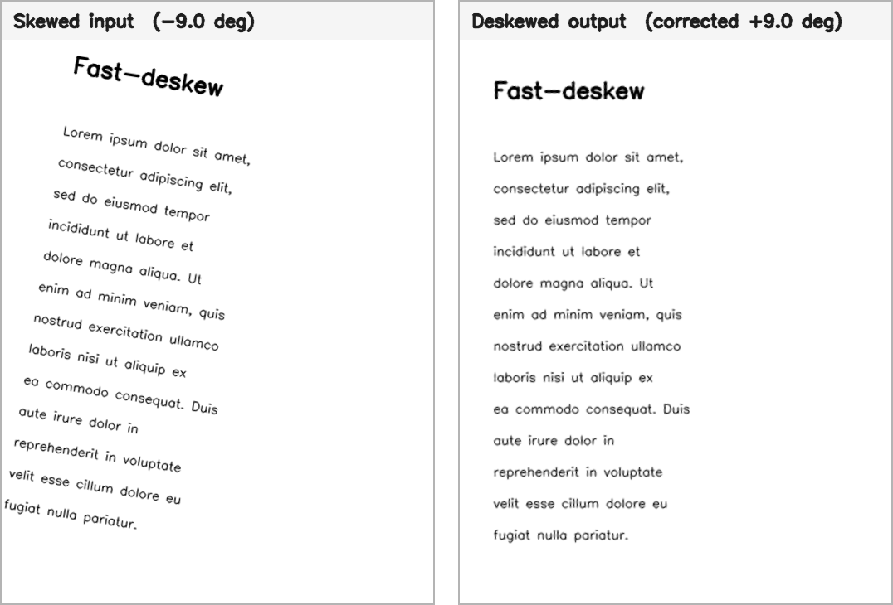

# Fast-deskew


A fast drop-in alternative to the excellent [deskew](https://github.com/sbrunner/deskew)
library by [sbrunner](https://github.com/sbrunner), using OpenCV instead of
scikit-image for the heavy lifting. It estimates the skew angle of a document
image so you can rotate it back to straight.

On sbrunner's own test set it returns the **same angles** while running
**~9× faster** (see [Benchmark](#benchmark)).



## Installation
- Using pip:
```
pip install fast-deskew-cv
```
- From source:
```
pip install git+https://git@github.com/HOZHENWAI/fast_deskew.git
```

## Usage
```python
import cv2
from deskew import determine_skew

image_grayscale = cv2.imread('input_image.png', cv2.IMREAD_GRAYSCALE)
skew_angle = determine_skew(image_grayscale)
```

`determine_skew` returns the skew angle in degrees (or `None` if no dominant
orientation is found). To straighten the image, rotate it by `+skew_angle`:

```python
import cv2
from deskew import determine_skew

image = cv2.imread('input_image.png')
grayscale = cv2.cvtColor(image, cv2.COLOR_BGR2GRAY)

angle = determine_skew(grayscale)
if angle is not None:
    height, width = image.shape[:2]
    matrix = cv2.getRotationMatrix2D((width / 2, height / 2), angle, 1.0)
    deskewed = cv2.warpAffine(image, matrix, (width, height),
                              borderValue=(255, 255, 255))
    cv2.imwrite('output_image.png', deskewed)
```

## How it works
The classical Hough-transform skew-detection pipeline:

1. **Blur** the image (Gaussian) to suppress noise.
2. **Canny edge detection** — thresholds are derived from a percentile of the
   image's gradient magnitude, so the same defaults work across document sizes
   and contrasts.
3. **Hough line transform** to find straight edges.
4. **Fold** every line orientation into a canonical interval (so text baselines
   and vertical strokes, which differ by ~90°, reinforce the same estimate) and
   return the most frequent (modal) angle from the strongest lines.

## Parameters
| Parameter | Default | Description |
|---|---|---|
| `image_array` | – | 8-bit single-channel (grayscale) image. |
| `sigma` | `3.0` | Standard deviation of the Gaussian pre-blur. |
| `num_peaks` | `20` | Number of strongest Hough lines used to vote on the angle. |
| `angle_pm_90` | `False` | Fold into `[-90, 90)` instead of `[-45, 45)`. |
| `min_angle` / `max_angle` | `None` | Restrict the reported skew to a degree range. |
| `min_deviation` | `1.0` | Angular resolution in degrees (also the voting bin width). |
| `gradient_percentile` | `99.0` | Gradient-magnitude percentile used as the high Canny threshold when auto-deriving. |
| `canny_threshold_low` / `canny_threshold_high` | `None` | Explicit Canny thresholds; `None` auto-derives them from the gradient. |
| `hough_rho` | `1.0` | Distance resolution of the Hough accumulator (pixels). |
| `hough_threshold` | `30` | Minimum Hough votes for a line (a floor; peak selection stays relative via `num_peaks`). |

## Benchmark
`fast-deskew` vs the reference `deskew` (1.6.1) on the reference library's own 8
test images. Both libraries receive the **same grayscale array**; timing is the
median of repeated calls and excludes image loading. Angles are compared against
the ground-truth values from the reference test suite.

| Image | Size | Ground truth | `deskew` | `fast-deskew` | Speed-up |
|------:|:----:|:------------:|:--------:|:-------------:|:--------:|
| 1 | 6172×4152 | −1.0° | −1.0° / 2781 ms | −1.0° / **320 ms** | 8.7× |
| 2 | 1748×1241 | −2.0° | −2.0° / 300 ms | −2.0° / **31 ms** | 9.7× |
| 3 | 1748×1241 | −6.0° | −6.0° / 286 ms | −6.0° / **27 ms** | 10.5× |
| 4 | 1748×1241 | 7.0° | 7.0° / 238 ms | 7.0° / **30 ms** | 7.9× |
| 5 | 724×1198 | 3.0° | 3.0° / 103 ms | 3.0° / **10 ms** | 10.1× |
| 6 | 1415×1120 | −3.0° | −3.0° / 209 ms | −3.0° / **20 ms** | 10.6× |
| 7 | 575×336 | 3.0° | 3.0° / 28 ms | 3.0° / **3.5 ms** | 7.9× |
| 8 | 3089×2435 | 15.0° | 15.0° / 702 ms | 15.0° / **73 ms** | 9.6× |

**Accuracy: 8/8 angles identical to the reference. Speed: ~9× faster** (median).

Measured on Python 3.14, OpenCV 4.13, scikit-image 0.26, AMD64. Absolute timings
are hardware-dependent; the relative speed-up is the meaningful figure.

## Notes & limitations
- Input is expected to be an 8-bit **grayscale** image (convert color images with
  `cv2.cvtColor(img, cv2.COLOR_BGR2GRAY)` first).
- For skews beyond ±45°/±90°, fix the global page rotation first and use this
  library for the residual fine skew. `angle_pm_90=True` widens the fold range.

## Development
```
pip install -e ".[dev]"
pytest
```

## License
MIT — see [LICENSE](LICENSE).

## Acknowledgements
Algorithm and test images from [sbrunner/deskew](https://github.com/sbrunner/deskew).
